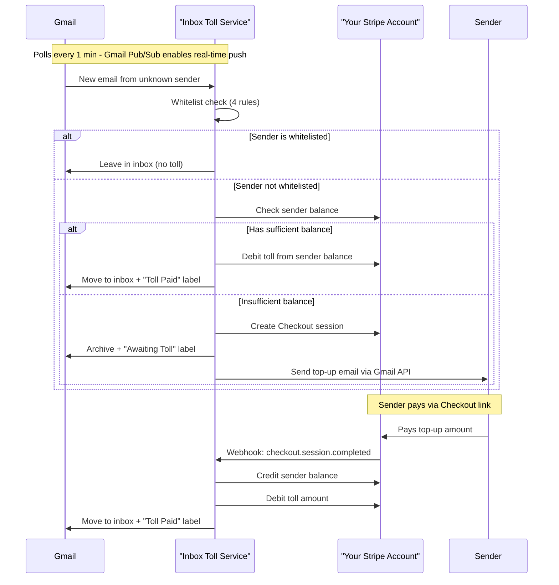

# Inbox Toll

A self-hosted, headless service that charges email senders a small fee (toll) to reach your Gmail inbox. Acts as a spam deterrent - senders willing to pay are more likely to be legitimate. (see [Known Limitations](#known-limitations) below) 

## What is Inbox Toll?

Inbox Toll protects your Gmail inbox by requiring senders to pay a small fee (default $0.25) before their email reaches your inbox. The system:

- **Polls your Gmail** every minute for new emails (the 1-minute interval is a placeholder; Gmail has a Pub/Sub that can be used for near real-time push notifications (not implemented))
- **Checks whitelist rules** to exempt known senders
- **Charges senders** via Stripe if they're not whitelisted
- **Archives emails** until payment is received
- **Moves emails to inbox** once payment is confirmed

Payments go directly to your Stripe account - no intermediaries, no platform fees beyond Stripe's standard processing fees. Stripe fees are paid for by the sender, not the inbox owner. 

## Quick Start

1. **Prerequisites:**
   - Docker and Docker Compose installed
   - A Gmail account
   - A Stripe account
   - A publicly accessible URL for Stripe webhooks (use ngrok for local testing)

2. **Clone and configure:**
   ```bash
   git clone <repository-url>
   cd inbox-toll
   cp .env.example .env  # Create your .env file
   ```

3. **Set up Google Cloud credentials** (see [Gmail Setup](#gmail-setup) below)

4. **Set up Stripe** (see [Stripe Setup](#stripe-setup) below)

5. **Configure environment variables** in `.env`:
   ```bash
   GMAIL_CREDENTIALS_JSON='{"web":{"client_id":"...","client_secret":"..."}}'
   GMAIL_EMAIL=your-email@gmail.com
   STRIPE_API_KEY=sk_test_...
   STRIPE_WEBHOOK_SECRET=whsec_...
   TOLL_SUCCESS_URL=https://your-domain.com/success
   TOLL_CANCEL_URL=https://your-domain.com/cancel
   # DRY_RUN defaults to true; set to false only when you want live toll processing (see Safety / Live Mode below)
   DRY_RUN=true
   ```

6. **Start the service:**
   ```bash
   docker compose up
   ```
## Prerequisites

Before you begin, ensure you have:

- **Docker** and **Docker Compose** installed
- A **Gmail account** you want to protect
- A **Stripe account** (test mode is fine for development)
- A **publicly accessible URL** for Stripe webhooks (use [ngrok](https://ngrok.com/) for local development)

## Gmail Setup

### Step 1: Create a Google Cloud Project

1. Go to [Google Cloud Console](https://console.cloud.google.com/)
2. Click "Create Project"
3. Name it (e.g., "Inbox Toll") and click "Create"

### Step 2: Enable Gmail API

1. In your project, go to **APIs & Services** > **Library**
2. Search for "Gmail API"
3. Click on it and click **Enable**

### Step 3: Create OAuth 2.0 Credentials

1. Go to **APIs & Services** > **Credentials**
2. Click **Create Credentials** > **OAuth client ID**
3. If prompted, configure the OAuth consent screen:
   - Choose "External" (unless you have a Google Workspace)
   - Fill in app name, user support email, developer contact
   - Add scopes: `https://www.googleapis.com/auth/gmail.modify`
   - Add test users (your Gmail address)
   - Save and continue through the steps
4. Back at Credentials, create OAuth client ID:
   - Application type: **Web application**
   - Name: "Inbox Toll"
   - Authorized redirect URIs: `http://localhost:8899/Callback` (for local OAuth flow)
     - **Important**: The URI must match exactly. Google requires an exact match between what's registered here and what the OAuth flow uses. The default callback path is `/Callback` (case-sensitive).
   - Click **Create**
5. Download the credentials JSON by clicking the download icon (⬇️) next to your newly created OAuth 2.0 Client ID. Set the contents of this file as your `GMAIL_CREDENTIALS_JSON` environment variable (as a single-line JSON string).

### Step 4: First-Time OAuth Authorization

On first run, the application will:
1. Open a browser window for Google OAuth consent
2. You'll authorize the app to access your Gmail
3. Tokens will be saved:
   - **Docker**: Stored in a container volume (`inbox_toll_tokens`). Not visible on the host; they persist across restarts as long as you don't run `docker compose down -v`.
   - **Local** (`./gradlew bootRun`): Saved to a `tokens/` directory in the project (created automatically, git ignored).

**Note:** The first authorization happens automatically when the app starts. When using Docker, ensure port 8899 is exposed (it's included in the default docker compose) so the OAuth callback can reach the app.

## Stripe Setup

### Step 1: Create a Stripe Account

1. Go to [Stripe](https://stripe.com/) and create an account
2. Complete your account setup (you can use test mode for development)

### Step 2: Get API Keys

1. Go to **Developers** > **API keys**
2. Copy your **Secret key** (starts with `sk_test_` for test mode, `sk_live_` for production)
3. Set this as `STRIPE_API_KEY` in your environment

### Step 3: Configure Webhook Endpoint

1. Go to **Developers** > **Webhooks**
2. Click **Add endpoint**
3. Enter your webhook URL: `https://your-domain.com/webhook/stripe`
   - For local testing with ngrok: `https://your-ngrok-url.ngrok.io/webhook/stripe`
4. Select events to listen to:
   - `checkout.session.completed`
5. Click **Add endpoint**
6. Copy the **Signing secret** (starts with `whsec_`)
7. Set this as `STRIPE_WEBHOOK_SECRET` in your environment

### Step 4: Set Up Checkout Success/Cancel URLs

Configure where senders should be redirected after payment:

- `TOLL_SUCCESS_URL`: Where to redirect after successful payment (e.g., `https://your-domain.com/success`)
- `TOLL_CANCEL_URL`: Where to redirect if payment is canceled (e.g., `https://your-domain.com/cancel`)

These can be simple static pages explaining the payment was processed.

## Configuration Reference

All configuration is done via environment variables:

| Variable | Required | Default | Description | Example |
|----------|:--------:|---------|-------------|---------|
| `GMAIL_CREDENTIALS_JSON` | ✅ | _(none)_ | Google OAuth2 credentials JSON (single-line) | `{"web":{"client_id":"..."}}` |
| `GMAIL_EMAIL` | ✅ | _(none)_ | Your Gmail address to protect | `you@gmail.com` |
| `STRIPE_API_KEY` | ✅ | _(none)_ | Stripe secret API key | `sk_test_...` |
| `STRIPE_WEBHOOK_SECRET` | ✅ | _(none)_ | Stripe webhook signing secret | `whsec_...` |
| `TOLL_SUCCESS_URL` | ❌ | `https://example.com/success` | Stripe Checkout success redirect URL | `https://example.com/success` |
| `TOLL_CANCEL_URL` | ❌ | `https://example.com/cancel` | Stripe Checkout cancel redirect URL | `https://example.com/cancel` |
| `TOLL_AMOUNT` | ❌ | `0.25` | Toll amount in dollars | `0.50` |
| `TRUSTED_DOMAINS` | ❌ | _(empty)_ | Comma-separated exempt domains | `mycompany.com,partner.org` |
| `POLL_INTERVAL_SECONDS` | ❌ | `60` | How often to poll Gmail | `30` |
| `TOLL_EMAIL_SUBJECT` | ❌ | `Payment required to reach my inbox` | Payment email subject template | `Please pay to deliver your email` |
| `TOLL_EMAIL_BODY` | ❌ | _(empty)_ | Payment email body template (HTML) | `<p>Pay {tollAmount}: <a href="{paymentLink}">link</a></p>` |
| `TOLL_EMAIL_FROM_NAME` | ❌ | _(empty)_ | Display name for sent emails | `Inbox Toll` |
| `DATABASE_URL` | ❌ | `jdbc:postgresql://localhost:5432/inboxtoll` | PostgreSQL connection string | `jdbc:postgresql://db:5432/inboxtoll` |
| `DATABASE_USER` | ❌ | `postgres` | PostgreSQL username | `postgres` |
| `DATABASE_PASSWORD` | ❌ | `postgres` | PostgreSQL password | `postgres` |
| `PORT` | ❌ | `8080` | Application port | `8080` |
| `DRY_RUN` | ❌ | `true` | When true, no Stripe/Gmail/DB writes occur; set to `false` to enable live toll processing | `false` |

### Safety / Live Mode

The app starts in **dry-run mode** by default (`DRY_RUN=true`). In this mode it does not perform any live actions: no Stripe charges or credits, no Gmail archiving/moving/sending, and no toll-related database writes. The service still polls Gmail and evaluates whitelist rules; it logs what it *would* do instead of doing it. This lets you verify configuration and behavior before enabling live mode.

To run with real toll processing (charge senders, move emails, process webhooks), set **`DRY_RUN=false`** in your environment. Only do this after you have confirmed your Stripe and Gmail setup.

### Email Template Placeholders

The email templates support these placeholders:

- `{tollAmount}` - The toll amount (e.g., "0.25")
- `{paymentLink}` - The Stripe Checkout payment link
- `{senderEmail}` - The sender's email address

Example custom body:
```html
<p>Hi,</p>
<p>A ${tollAmount} fee is required to deliver your message to my inbox.</p>
<p><a href="{paymentLink}">Click here to pay</a></p>
```

## Whitelist Rules

Senders are automatically exempted from tolls if they meet any of these criteria:

1. **Same Domain**: Sender's domain matches your Gmail domain (same Google Workspace)
2. **Trusted Domains**: Sender's domain is in your `TRUSTED_DOMAINS` list
3. **CC'd Trusted Contacts**: Any TO/CC recipient is from a trusted domain (handles introductions)
4. **Known Sender**: You have previously sent an email to this sender (checked via Gmail sent folder)

Rules are checked in order - if any rule matches, the sender is exempted.

## How Sender Payments Work

### Flow Overview



**Gmail labels** (created automatically): *Awaiting Toll* (archived, payment pending) and *Toll Paid* (delivered to inbox).

### Detailed Steps

1. **Email Arrives**: Gmail polling task detects new email
2. **Whitelist Check**: System checks if sender is exempted (4 rules)
3. **Balance Check**: If not exempted, checks sender's Stripe customer balance
4. **Sufficient Balance**: If balance covers toll, debits immediately and moves email to inbox
5. **Insufficient Balance**: Creates Stripe Checkout link, archives email, sends payment request email
6. **Payment**: Sender clicks link, pays via Stripe Checkout
7. **Webhook**: Stripe sends webhook to your service
8. **Processing**: Service credits sender balance, debits toll, moves email to inbox

### Stripe Customer Balance Model

Each sender gets a Stripe Customer object with a balance (like a prepaid wallet):
- **Credits** (negative balance): When sender pays via Checkout
- **Debits** (positive balance): When toll is charged
- **Money flows**: Directly to your Stripe account (no Connect needed)

### Balance Top-Up Details

When a sender has insufficient balance to cover the toll, the system creates a Stripe Checkout session for them to top up their balance. The sender pays a minimum of $1.00 (or the toll amount, whichever is higher). Stripe processing fees (2.9% + $0.30) are deducted from the payment, and the net amount is credited to the sender's Stripe Customer balance as prepaid credit. After the top-up is completed, the original toll is automatically debited from the newly credited balance and the held email is moved to the inbox. Any remaining credit carries over for future emails from that sender.

### Known Limitations

**Per-Instance Balance Scope**: This toll functionality was originally part a SaaS side project I was building. Sender balances could be pooled across recipients on my platform. Now that I've pulled it out into a self-hosted service, each user runs their own instance with their own Stripe account, so a sender's balance is scoped to the single person they are trying to email. If the same sender emails two different people who each run Inbox Toll, they must top up separately with each -- balances do not transfer or share across instances. This breaks the experience when a real human is the sender but _probably_ still works to protect against unwanted bot or agent spam.

**One Minute Inbox Polling** The system polls Gmail on a fixed interval (default 60 seconds), so it is not real-time. A new email may sit in your inbox for up to a minute before it is checked and labeled. The Gmail API supports Pub/Sub for truly real-time notification capture.

## Architecture

```
┌─────────────────────────────────────────────────────────┐
│                    Gmail API                             │
│   (Polling ~1 min; Pub/Sub enables real-time)            │
└───────────────────┬─────────────────────────────────────┘
                    │
                    ▼
┌─────────────────────────────────────────────────────────┐
│              GmailPollingTask                           │
│         (@Scheduled cron: "0 * * * * *")                │
└───────────────────┬─────────────────────────────────────┘
                    │
                    ▼
┌─────────────────────────────────────────────────────────┐
│                  TollService                             │
│  • Whitelist check                                       │
│  • Balance check                                         │
│  • Debit or create top-up link                          │
└───────┬───────────────────────────────┬─────────────────┘
        │                               │
        ▼                               ▼
┌───────────────┐              ┌──────────────────┐
│ Whitelist     │              │ StripeService     │
│ Service       │              │ • Customer mgmt   │
│ • 4 rules     │              │ • Balance ops    │
└───────────────┘              │ • Checkout       │
                               └────────┬─────────┘
                                        │
                                        ▼
                            ┌───────────────────────┐
                            │   Stripe API          │
                            │   (Your Account)      │
                            └───────────┬───────────┘
                                        │
                                        │ Webhook
                                        ▼
                            ┌───────────────────────┐
                            │ StripeWebhookController│
                            │ • Credit balance      │
                            │ • Process toll        │
                            └───────────────────────┘
```

## Troubleshooting

### Gmail OAuth Issues

**Problem**: "OAuth consent screen" errors
- **Solution**: Make sure you've added your Gmail address as a test user in the OAuth consent screen

**Problem**: Port 8899 already in use
- **Solution**: Change the port in `GmailConfig.java` or stop the service using that port

**Problem**: Tokens not persisting
- **Docker**: Tokens live in the `inbox_toll_tokens` volume. Avoid `docker compose down -v` (the `-v` flag removes volumes). If you've already removed the volume, re-run the OAuth flow.
- **Local**: Ensure the `tokens/` directory is writable.

**Problem**: "You can't sign in to this app because it doesn't comply with Google's OAuth 2.0 policy" / redirect_uri mismatch
- **Solution**: In Google Cloud Console > APIs & Services > Credentials > your OAuth client, ensure `http://localhost:8899/Callback` is listed under "Authorized redirect URIs". The URI must match exactly (case-sensitive). Check the application logs for the actual redirect URI being used if you're unsure.

### Stripe Webhook Issues

**Problem**: Webhooks not being received
- **Solution**: 
  - Verify webhook URL is publicly accessible (use ngrok for local testing)
  - Check Stripe Dashboard > Webhooks for delivery attempts
  - Verify `STRIPE_WEBHOOK_SECRET` matches the signing secret in Stripe

**Problem**: "Invalid signature" errors
- **Solution**: Ensure `STRIPE_WEBHOOK_SECRET` is correct and matches your webhook endpoint

### Email Processing Issues

**Problem**: Emails not being processed
- **Solution**: 
  - Check application logs: `docker compose logs -f app`
  - Verify Gmail polling is running (should see "Starting Gmail polling task" every minute)
  - Check if emails are already processed (deduplication prevents reprocessing)

**Problem**: Senders not receiving payment emails
- **Solution**:
  - Check Gmail API quota limits
  - Verify email is being sent (check logs)
  - Ensure sender email is valid

### Database Issues

**Problem**: Database connection errors
- **Solution**:
  - Verify PostgreSQL container is running: `docker compose ps`
  - Check database credentials in environment variables
  - Ensure database is healthy: `docker compose logs db`

## Development

### Building Locally

```bash
./gradlew build
```

### Running Tests

```bash
./gradlew test
```

### Running Without Docker

1. Start PostgreSQL locally
2. Set `DATABASE_URL` to point to your local database
3. Run: `./gradlew bootRun`

## License

This project is licensed under the **MIT License**.

You are free to use, modify, and distribute this software with attribution. See the `LICENSE` file for the full license text.

## Contributing

Contributions are welcome.

- Fork the repository and create a branch for your change.
- Run `./gradlew test` before opening a PR.

## Support

If you need help, have a bug report, or want to request a feature:

- **Open an issue** in this repository with clear steps to reproduce (for bugs), expected behavior, and relevant logs/config details.
- For security-sensitive reports, avoid posting secrets or private credentials in public issues.
